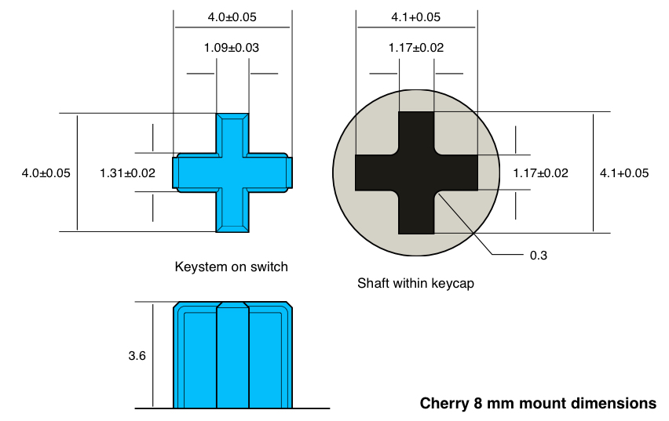

# Key Cap Converter Stem
Convert the existing Soviet-era key caps for use with Cherry MX-style key caps. 

## Dimensions
Soviet VM16-style key cap has a stem that is 2.3mm in diameter and 11mm in length. 

The Cherry MX-style attachment is as [below](https://telcontar.net/KBK/Cherry/images/MX/Cherry_8_mm_mount.svgz):

## Design
- Start with a cylinder 15mm tall (11+4) and 8mm in diameter
- Subtract an internal cylinder 11mm tall and 2.5mm in diameter
- Subtract a cross 4mm in height with 4mm arms that are 1.2mm thick

Maybe?

## Status
4-Aug-2025: Initial design in TinkerCAD & STL file generated
